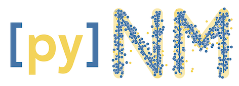
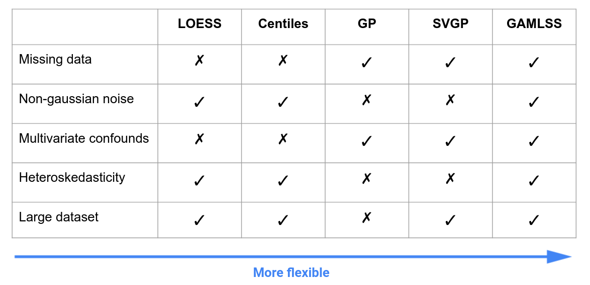

[](https://pypi.org/project/pynm/) <a href="https://travis-ci.org/ppsp-team/pynm"></a> [](https://opensource.org/licenses/BSD-3-Clause) <a href="https://zenodo.org/record/5823034#.YdX2kxNOlwg"></a>

PyNM is a lightweight python implementation of Normative Modeling making it approachable and easy to adopt. The package provides:

- Python API and a command-line interface for wide accessibility
- Automatic dataset splitting and cross-validation
- Five models from various back-ends in a unified interface that cover a broad range of common use cases
   - Centiles
   - LOESS
   - Gaussian Process (GP)
   - Stochastic Variational Gaussian Process (SVGP)
   - Generalized Additive Models of Location Shape and Scale (GAMLSS)
- Solutions for very large datasets and heteroskedastic data
- Integrated plotting and evaluation functions to quickly check the validity of the model fit and results
- Comprehensive and interactive tutorials

For a more advanced implementation, see the Python library [PCNtoolkit](https://github.com/amarquand/PCNtoolkit).

## Installation

**Minimal Installation (without R)**

If you aren't using the GAMLSS model/don't need to install R.

```bash
$ pip install pynm
```

**Installation with R**

If you are using a GAMLSS.
- Must first have R installed and packages:
     - gamlss
     - gamlss.dist
     - gamlss.data
     
Instruction for installing R can be found at [r-project](https://www.r-project.org/). Once R and the `gamlss` packages are installed, install pynm:
```bash
$ pip install pynm
```
**Bleeding-edge Installation**

If you want to be up to date with the most recent changes to PyNM (not necessarily stable). For the options above replace `pip install pynm` with:
```bash
$ git clone https://github.com/ppsp-team/PyNM.git
$ cd pynm
$ pip install .
```

## Command Line Usage
```
usage: pynm [-h] --pheno_p PHENO_P --out_p OUT_P --confounds CONFOUNDS --score
            SCORE --group GROUP [--train_sample TRAIN_SAMPLE] [--LOESS]
            [--centiles] [--bin_spacing BIN_SPACING] [--bin_width BIN_WIDTH]
            [--GP] [--gp_method GP_METHOD] [--gp_num_epochs GP_NUM_EPOCHS]
            [--gp_n_inducing GP_N_INDUCING] [--gp_batch_size GP_BATCH_SIZE]
            [--gp_length_scale GP_LENGTH_SCALE]
            [--gp_length_scale_bounds [GP_LENGTH_SCALE_BOUNDS [GP_LENGTH_SCALE_BOUNDS ...]]]
            [--gp_nu NU] [--GAMLSS] [--gamlss_mu GAMLSS_MU]
            [--gamlss_sigma GAMLSS_SIGMA] [--gamlss_nu GAMLSS_NU]
            [--gamlss_tau GAMLSS_TAU] [--gamlss_family GAMLSS_FAMILY]

optional arguments:
  -h, --help            show this help message and exit
  --pheno_p PHENO_P     Path to phenotype data. Data must be in a .csv file.
  --out_p OUT_P         Path to output directory.
  --confounds CONFOUNDS
                        List of confounds to use in the GP model.The list must
                        formatted as a string with commas between confounds,
                        each confound must be a column name from the phenotype
                        .csv file. For GP model all confounds will be used,
                        for LOESS and Centiles models only the first is used.
                        For GAMLSS all confounds are used unless formulas are
                        specified. Categorical values must be denoted by
                        c(var) ('c' must be lower case), e.g. 'c(SEX)' for
                        column name 'SEX'.
  --score SCORE         Response variable for all models. Must be a column
                        title from phenotype .csv file.
  --group GROUP         Column name from the phenotype .csv file that
                        distinguishes probands from controls. The column must
                        be encoded with str labels using 'PROB' for probands
                        and 'CTR' for controls or with int labels using 1 for
                        probands and 0 for controls.
  --train_sample TRAIN_SAMPLE
                        Which method to use for a training sample, can be a
                        float in (0,1] for a percentage of controls or
                        'manual' to be manually set using a column of the
                        DataFrame labelled 'train_sample'.
  --LOESS               Flag to run LOESS model.
  --centiles            Flag to run Centiles model.
  --bin_spacing BIN_SPACING
                        Distance between bins for LOESS & centiles models.
  --bin_width BIN_WIDTH
                        Width of bins for LOESS & centiles models.
  --GP                  Flag to run Gaussian Process model.
  --gp_method GP_METHOD
                        Method to use for the GP model. Can be set to
                        'auto','approx' or 'exact'. In 'auto' mode, the exact
                        model will be used for datasets smaller than 2000 data
                        points. SVGP is used for the approximate model. See
                        documentation for details. Default value is 'auto'.
  --gp_num_epochs GP_NUM_EPOCHS
                        Number of training epochs for SVGP model. See
                        documentation for details. Default value is 20.
  --gp_n_inducing GP_N_INDUCING
                        Number of inducing points for SVGP model. See
                        documentation for details. Default value is 500.
  --gp_batch_size GP_BATCH_SIZE
                        Batch size for training and predicting from SVGP
                        model. See documentation for details. Default value is
                        256.
  --gp_length_scale GP_LENGTH_SCALE
                        Length scale of Matern kernel for exact model. See
                        documentation for details. Default value is 1.
  --gp_length_scale_bounds [GP_LENGTH_SCALE_BOUNDS [GP_LENGTH_SCALE_BOUNDS ...]]
                        The lower and upper bound on length_scale. If set to
                        'fixed', length_scale cannot be changed during
                        hyperparameter tuning. See documentation for details.
                        Default value is (1e-5,1e5).
  --gp_nu NU            Nu of Matern kernel for exact and SVGP model. See
                        documentation for details. Default value is 2.5.
  --GAMLSS              Flag to run GAMLSS.
  --gamlss_mu GAMLSS_MU
                        Formula for mu (location) parameter of GAMLSS. Default
                        formula for score is sum of confounds with non-
                        categorical columns as smooth functions, e.g. 'score ~
                        ps(age) + sex'.
  --gamlss_sigma GAMLSS_SIGMA
                        Formula for mu (location) parameter of GAMLSS. Default
                        formula is '~ 1'.
  --gamlss_nu GAMLSS_NU
                        Formula for mu (location) parameter of GAMLSS. Default
                        formula is '~ 1'.
  --gamlss_tau GAMLSS_TAU
                        Formula for mu (location) parameter of GAMLSS. Default
                        formula is '~ 1'.
  --gamlss_family GAMLSS_FAMILY
                        Family of distributions to use for fitting, default is
                        'SHASHo2'. See R documentation for GAMLSS package for
                        other available families of distributions.
```
## API Example
```python
from pynm.pynm import PyNM

# Load data
df = pd.read_csv('data.csv')

# Initialize pynm w/ data and confounds
m = PyNM(df,'score','group', confounds = ['age','c(sex)','c(site)'])

# Run models
m.loess_normative_model()
m.centiles_normative_model()
m.gp_normative_model()
m.gamlss_normative_model()

# Collect output
data = m.data
```

## Documentation

All the functions have the classical Python DocStrings that you can summon with ```help()```. You can also see the [tutorials](https://github.com/ppsp-team/PyNM/tree/master/tutorials) for documented examples.

### Training sample
By default, the models are fit on all the controls in the dataset and prediction is then done on the entire dataset. The residuals (scores of the normative model) are then calculated as the difference between the actual value and predicted value for each subject. This paradigm is not meant for situations in which the residuals will then be used in a prediction setting, since any train/test split stratified by proband/control will have information from the training set leaked into the test data.

In order to avoid contaminating the test set, in a prediction setting it is important to fit the normative model on a subset of the controls and then leave those out. This is implemented in PyNM with the `--train_sample` flag. It can be set to:
 1. A number in (0,1]
    - This is simplest usage that defines the sample size, PyNM will then select a random sample of the controls and use those as a training group. The number is the proportion of controls to use, the default value is 1 to use the full set of controls.
    - The subjects used in the sample are recorded in the column `'train_sample'` of the resulting PyNM.data object. Subjects used in the training sample are encoded as 1s, and the rest as 0s. 
 2. `'manual'`
    - It is also possible to specify exactly which subjects to use as a training group by providing a column in the input data labeled `'train_sample'` encoded the same way.

### Models
#### Centiles and LOESS Models
Both the Centiles and LOESS models are non parametric models based local approximations. They accept only a single dependent variable, passed using the `conf` option.

#### Gaussian Process Model
Gaussian Process Regression (GPR), which underpins the Gaussian Process Model, can accept an arbitrary number of dependent variables passed using the `confounds` option. Note: in order for GPR to be effective, the data must be homoskedastic. For a full discussion see [this paper](https://www.biorxiv.org/content/10.1101/2021.05.11.443565v1.full).

GPR is very intensive on both memory and time usage. In order to have a scaleable method, we've implemented both an exact model for smaller datasets and an approximate method, recommended for datasets over ~1000 subjects. The method can be specified using the `method` option, it defaults to `auto` in which the approxiamte model will be chosen for datasets over 1000.

##### Exact Model
The exact model implements [scikit-learn](https://scikit-learn.org/stable/index.html)'s Gaussian Process Regressor. The kernel is composed of a constant kernel, a white noise kernel, and a Matern kernel. The Matern kernel has parameters `nu` and `length_scale` that can be specified. The parameter `nu` has special values at 1.5 and 2.5, using other values will significantly increase computation time. See [documentation](https://scikit-learn.org/stable/modules/gaussian_process.html) for an overview of both.

##### Approximate Model
The approximate model implements a Stochastic Variational Gaussian Process (SVGP) model using [GPytorch](https://gpytorch.ai/), with a kernel closely matching the one in the exact model. SVGP is a deep learning technique that needs to be trained on minibatches for a set number of epochs, this can be tuned with the parameters `batch_size` and `num_epoch`. The model speeds up computation by using a subset of the data as inducing points, this can be controlled with the parameter `n_inducing` that defines how many points to use. See [documentation](https://docs.gpytorch.ai/en/v1.1.1/examples/04_Variational_and_Approximate_GPs/SVGP_Regression_CUDA.html) for an overview.

#### GAMLSS
Generalized Additive Models of Location Shape and Scale (GAMLSS) are a flexible modeling framework that can model heteroskedasticity, non-linear effects of variables, and hierarchical structure of the data. The implementation here is a python wrapper for the R package gamlss, formulas for each parameter must be specified using functions available in the package (see [documentation](https://cran.r-project.org/web/packages/gamlss/index.html)). For a full discussion of using GAMLSS for normative modeling see [this paper](https://doi.org/10.1101/2021.06.14.448106).



## References

Original papers with Gaussian Processes (GP):
- Marquand et al. Biological Psychiatry 2016 [doi:10.1016/j.biopsych.2015.12.023](https://doi.org/10.1016/j.biopsych.2015.12.023)
- Marquand et al. Molecular Psychiatry 2019 [doi:10.1038/s41380-019-0441-1](https://doi.org/10.1038/s41380-019-0441-1)

For limitations of Gaussian Proccesses:
- Xu et al. PLoS ONE 2021, [The pitfalls of using Gaussian Process Regression for normative modeling](https://doi.org/10.1371/journal.pone.0252108)

Example of use of the LOESS approach:
- Lefebvre et al. Front. Neurosci. 2018 [doi:10.3389/fnins.2018.00662](https://doi.org/10.3389/fnins.2018.00662)
- Maruani et al. Front. Psychiatry 2019 [doi:10.3389/fpsyt.2019.00011](https://doi.org/10.3389/fpsyt.2019.00011)

For the Centiles approach see:
- Bethlehem et al. Communications Biology 2020 [doi:10.1038/s42003-020-01212-9](https://doi.org/10.1038/s42003-020-01212-9)
- R implementation [here](https://github.com/rb643/Normative_modeling).

For the SVGP model see:
- Hensman et al. [https://arxiv.org/pdf/1411.2005.pdf](https://arxiv.org/pdf/1411.2005.pdf)

For GAMLSS see:
- Dinga et al. [https://doi.org/10.1101/2021.06.14.448106](https://doi.org/10.1101/2021.06.14.448106)
- R documentation [https://cran.r-project.org/web/packages/gamlss/index.html](https://cran.r-project.org/web/packages/gamlss/index.html)

## How to run tests

To test the code locally, first make sure R and the required packages are installed then follow the instructions above under **Installation: Bleeding-edge Installation**. Finally, run:

```bash
$ pip install -r requirements.txt
$ pytest test/test_pynm.py
```

## How to report errors

If you spot any bugs :beetle:? Check out the [open issues](https://github.com/ppsp-team/PyNM/issues) to see if we're already working on it. If not, open up a new issue and we will check it out when we can!

## How to contribute

Thank you for considering contributing to our project! Before getting involved, please review our [contribution guidelines](https://github.com/ppsp-team/PyNM/blob/master/CONTRIBUTING.md).

## Support

This work is supported by [IVADO](https://ivado.ca/), [FRQS](http://www.frqs.gouv.qc.ca/en/), [CFI](https://www.innovation.ca/), [MITACS](https://www.mitacs.ca/en), and [Compute Canada](https://computecanada.ca).
